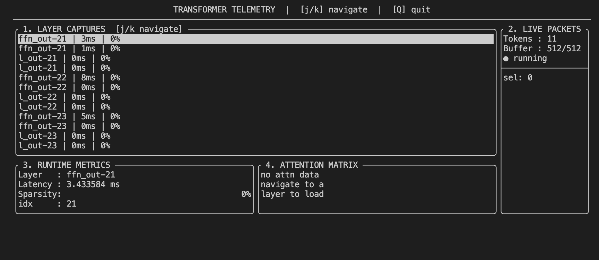

# Transformer Telemetry

A lightweight terminal UI diagnostic tool for local transformer models running via llama.cpp.

## What it does

Hooks non-invasively into llama.cpp's inference pipeline and captures real-time metrics:

- Per-layer execution latency
- Activation sparsity per layer
- Attention weight visualization
- Live token stream

## Demo


## Architecture
## Dependencies

- [llama.cpp](https://github.com/ggml-org/llama.cpp)
- [FTXUI](https://github.com/ArthurSonzogni/FTXUI) (fetched automatically via CMake)

## Build

```bash
# 1. clone and build llama.cpp first
git clone https://github.com/ggml-org/llama.cpp
cd llama.cpp && cmake -B build && cmake --build build -j4
cd ..

# 2. clone this repo
git clone https://github.com/mrityunjay007ved/Tracing-and-Replay.git
cd transformer-telemetry

# 3. build (point to your llama.cpp folder)
cmake -B build -DLLAMA_DIR=/path/to/llama.cpp
cmake --build build -j4

# 4. run with any GGUF model
./build/llama-telemetry your_model.gguf "your prompt here"
```

## Controls

| Key | Action      |
|-----|-------------|
| j   | scroll down |
| k   | scroll up   |
| Q   | quit        |

## Panels

1. **Layer Captures** — per-layer latency and sparsity, live updating
2. **Live Packets** — token count and buffer status  
3. **Runtime Metrics** — detailed view of selected layer
4. **Attention Matrix** — token-to-token attention weights (WIP)