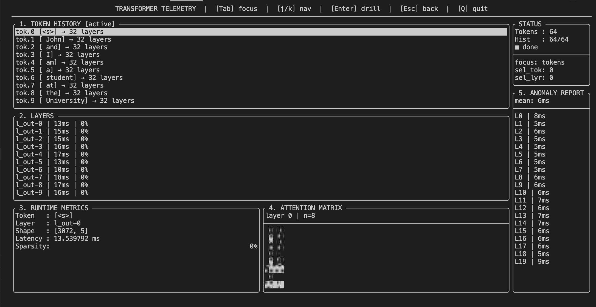

# Transformer Telemetry

A lightweight C++ terminal UI for inspecting local transformer model internals in real time — built on top of [llama.cpp](https://github.com/ggml-org/llama.cpp).

## Demo


## What it does

Hooks non-invasively into llama.cpp's `cb_eval` callback — no model source code modified — and captures real-time metrics as tokens flow through the transformer:

- **Per-layer execution latency** — see which of the 32 layers dominates compute time
- **Tensor shape inspection** — shape of each layer's output tensor
- **Attention matrix visualization** — real `kq_soft_max` weights rendered as ASCII block characters
- **Activation sparsity** — fraction of near-zero activations per layer
- **Anomaly detection** — automatically flags layers with latency or sparsity outliers
- **Token history** — navigate by token, then drill into per-layer data

## Architecture

```
llama_decode fires
    ↓ cb_eval callback (fires after every tensor op)
    ↓ captures latency + sparsity per layer
RingBuffer (512 slots, mutex-protected)
    ↓ TUI reads every 200ms
FTXUI TUI (4 panels, j/k navigation)
```
## Panels

| Panel | Description |
|-------|-------------|
| 1. TOKEN HISTORY | All tokens generated, navigate with j/k |
| 2. LAYERS | Per-layer latency and sparsity for selected token |
| 3. RUNTIME METRICS | Tensor shape, latency, sparsity for selected layer |
| 4. ATTENTION MATRIX | Real kq_soft_max attention weights as block characters |
| 5. ANOMALY REPORT | Per-layer averages across all tokens, flags outliers |

## Controls

| Key | Action |
|-----|--------|
| Tab | Cycle focus between panels |
| j / k | Scroll down / up in active panel |
| Enter | Drill into selected token or layer |
| Esc | Go back one level |
| Q | Quit |

## Dependencies

- [llama.cpp](https://github.com/ggml-org/llama.cpp) — must be cloned and built separately
- [FTXUI](https://github.com/ArthurSonzogni/FTXUI) — fetched automatically via CMake FetchContent

## Build

```bash
# 1. clone and build llama.cpp
git clone https://github.com/ggml-org/llama.cpp
cd llama.cpp
cmake -B build && cmake --build build -j4
cd ..

# 2. clone this repo
git clone https://github.com/mrityunjay007ved/Tracing-and-Replay.git
cd Tracing-and-Replay

# 3. build — point LLAMA_DIR to your llama.cpp folder
cmake -B build -DLLAMA_DIR=/path/to/llama.cpp
cmake --build build -j4

# 4. download a GGUF model (example: Phi-3 mini ~2.2GB)
# https://huggingface.co/microsoft/Phi-3-mini-4k-instruct-gguf

# 5. run
./build/llama-telemetry your_model.gguf "your prompt here"
```

## Notes

- Runs inference on CPU (`n_gpu_layers=0`) to keep attention tensors readable from host memory. GPU mode disables the attention matrix panel.
- Flash attention is disabled (`LLAMA_FLASH_ATTN_TYPE_DISABLED`) to expose `kq_soft_max` tensors for visualization.
- Ring buffer caps at 512 entries so RAM usage stays bounded regardless of how long inference runs.
- Tested on Apple M1 with Phi-3-mini-4k-instruct-q4.gguf.

## Implementation notes

The core hook is registered via `ctx_params.cb_eval` before calling `llama_init_from_model`. This callback fires after every ggml tensor operation during `llama_decode`, allowing inspection of intermediate states without modifying any model code. Tensors filtered to `l_out-{layer}` (full layer output) and `kq_soft_max-{layer}` (attention weights).
